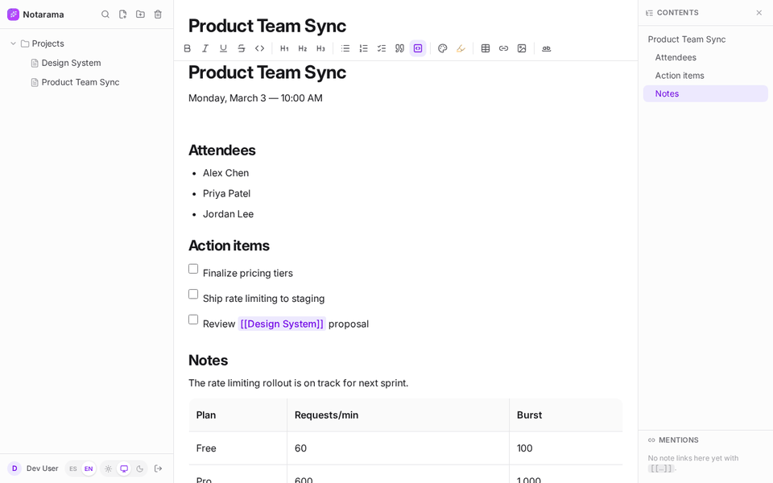

# Notarama

Notarama is a self-hosted personal knowledge base and wiki designed for structured thinking, fast capture, and long-term organization.

It combines hierarchical folders, rich markdown notes, instant full-text search, and a fast offline-first experience in one app, while integrating cleanly with standard OIDC/OAuth providers for secure authentication.



## Why Notarama?

Built for people who want their notes to be more than a flat list of documents:

- Organize ideas in a flexible folder tree with drag-and-drop reordering
- Write in a rich editor with markdown, tables, colors, images, and automatic table of contents
- Keep everything searchable with full-text indexing
- Secure access with enterprise-ready OIDC/OAuth integration
- Work locally even without connectivity, then sync automatically when the connection returns
- Keep the app self-hosted and easy to deploy with a single binary or Docker image

## Product highlights

- Hierarchical note organization with a draggable sidebar
- Rich editing experience for markdown-based content
- Full-text search across notes and content
- Installable PWA experience with local storage and sync support
- OIDC/OAuth authentication integration for seamless SSO with standard providers
- Self-hosted deployment model with simple setup, full ownership of your data, and no vendor lock-in
- SQLite-backed persistence with no external database required

## Tech stack

- **Backend**: Go, SQLite (`modernc.org/sqlite`, no CGO), FTS5 search, and standards-based OIDC/OAuth authentication via `coreos/go-oidc` with secure cookie-based session management
- **Frontend**: React + TypeScript + Tailwind CSS v4 + Vite, with a PWA built via `vite-plugin-pwa`
- **Local data layer**: IndexedDB via Dexie, with synchronization to the backend when online
- **Editor**: TipTap-based rich text editing with markdown-friendly workflows

## Mobile and PWA experience

Notarama is built as a Progressive Web App, so once it is deployed on your own server or custom domain, it can be installed directly on Android and iPhone as a native-like app.

This gives you a fast, app-like experience without relying on a proprietary mobile app. On mobile, notes remain available offline, and changes are synchronized automatically when the device reconnects.

### Install on Android

1. Open the deployed Notarama URL in Chrome or a modern Android browser.
2. Tap the browser menu.
3. Choose "Install app" or "Add to Home screen".
4. Confirm the installation.
5. Launch the app from the home screen and sign in through your OIDC provider.

### Install on iPhone / iPad

1. Open the deployed Notarama URL in Safari.
2. Tap the Share button.
3. Select "Add to Home Screen".
4. Confirm the name and add the app.
5. Open the installed app from the home screen.

### Offline mode and sync

After installation, the app works in offline mode using the local browser storage. Any edits made while disconnected are queued and synchronized automatically once the network is available again. This makes Notarama a strong fit for mobile note capture, reading, and lightweight editing in the field.

## Local development

Requires Go 1.25+ and Node 20+.

Start the backend with a development bypass account so you do not need a real OIDC provider:

```bash
DEV_AUTH_BYPASS=1 SESSION_SECRET=devsecret go run ./cmd/notarama
```

Start the frontend in a second terminal. It proxies `/api` and `/auth` to `http://localhost:8099`, so adjust `LISTEN_ADDR` if you use a different port:

```bash
cd frontend
npm install
npm run dev
```

Then open `http://localhost:5173`.

### Build a single binary

```bash
cd frontend && npm run build && cd ..
go build -o notarama ./cmd/notarama
```

`npm run build` writes directly to `internal/web/dist`, which the backend embeds into the final binary.

## Configuration

Environment variables:

| Variable | Description | Default |
|---|---|---|
| `LISTEN_ADDR` | Server listen address | `:8080` |
| `DATA_DIR` | Directory for the SQLite database and uploaded attachments | `./data` |
| `APP_BASE_URL` | Public app URL used for OIDC callback construction | `http://localhost:8080` |
| `SESSION_SECRET` | Required. Any long random string | — |
| `OIDC_ISSUER_URL` | OIDC discovery URL of the provider | — |
| `OIDC_CLIENT_ID` | OIDC client ID | — |
| `OIDC_CLIENT_SECRET` | OIDC client secret | — |
| `OIDC_REDIRECT_URL` | Redirect URI registered with the provider | `${APP_BASE_URL}/auth/callback` |
| `DEV_AUTH_BYPASS` | If set to `1`, disables OIDC login and uses a local fixed user. **Development only.** | `0` |

`OIDC_ISSUER_URL`, `OIDC_CLIENT_ID`, and `OIDC_CLIENT_SECRET` are required unless `DEV_AUTH_BYPASS=1`. Any standard OIDC provider works, including Keycloak, Authentik, Zitadel, Auth0, Google, and others.

## Docker

```bash
docker build -t notarama .
docker run -p 8080:8080 \
  -e SESSION_SECRET=... \
  -e OIDC_ISSUER_URL=... -e OIDC_CLIENT_ID=... -e OIDC_CLIENT_SECRET=... \
  -e APP_BASE_URL=https://notas.midominio.com \
  -v notarama-data:/data \
  notarama
```

The image is published automatically to GHCR (`ghcr.io/<owner>/<repo>`) on pushes to `main` and on tags like `vX.Y.Z`. See `.github/workflows/docker-publish.yml` for details.

## Testing

```bash
go test ./...
cd frontend && npx tsc -b && npm run build
```

## Summary

Notarama is a self-hosted knowledge workspace that feels modern, fast, and friendly without requiring a heavy stack or a complex deployment model. It is designed for individuals and teams who want a reliable place to capture ideas, structure knowledge, and keep it searchable over time, while integrating cleanly with standard OIDC/OAuth identity providers for secure authentication.
